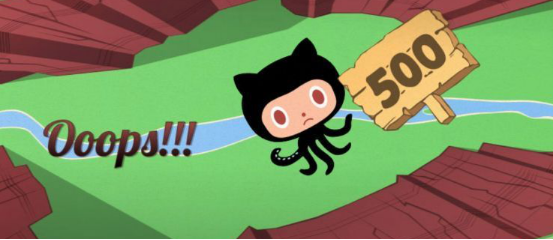

# tyou5351_9103_tut1
## try using Markdown

**learn to use github**

#Part 1. Parallax

**Parallax** refers to the apparent shift of an object caused by the observer’s changing perspective. Even though there’s only subtle differences between each frame, its 3D motion effect is still vividly exhibited.
When working on the major project, I think different parts of the chosen artwork could be extracted into separate layers and be animated at varying speeds to create a more dynamic and three-dimensional visual effect. Besides, this technique helps lay the foundation for individual tasks as different layers have been set, making the animation easier to implement.

[Link to the original artwork](https://x.com/TooRichCityNFT/status/1670721020607561728?s=20)

#Part 2

This is a page when GitHub encounters a 500 error. On this page, all elements are two-dimensional, but the page shows a dynamic parallax effect through the user’s mouse interaction.
To implement this effect, first, get the mouse’s position in the image, and then divide the x and y coordinates respectively by the image’s width and height to calculate the displacement distances. The **translate** function of the **transform** attribute is used to move each element in the direction of or opposite to the mouse (each element has a different offset), thus a parallax effect is being created.

[Link to the implementation code](https://codepen.io/stevenlei/pen/QWyBqmr)